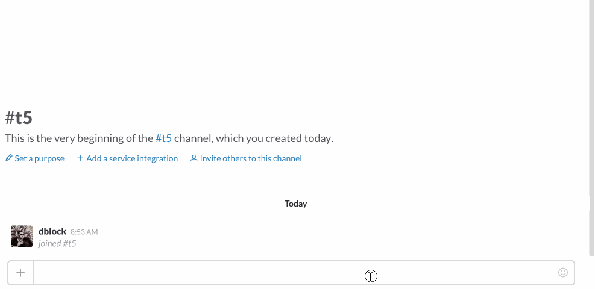
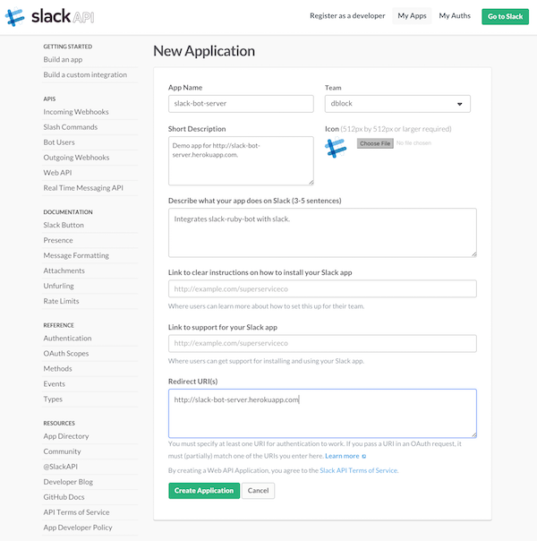

Slack Ruby Bot Server
=====================

[](https://badge.fury.io/rb/slack-ruby-bot-server)
[](https://travis-ci.org/slack-ruby/slack-ruby-bot-server)
[](https://codeclimate.com/github/slack-ruby/slack-ruby-bot-server)

A library that enables you to write a complete Slack bot service with Slack button integration, in Ruby. If you are not familiar with Slack bots or Slack API concepts, you might want to watch [this video](http://code.dblock.org/2016/03/11/your-first-slack-bot-service-video.html). A good demo of a service built on top of this is [missingkidsbot.org](http://missingkidsbot.org).

### What is this?

A library that contains a [Grape](http://github.com/ruby-grape/grape) API serving a [Slack Ruby Bot](https://github.com/slack-ruby/slack-ruby-bot) to multiple teams. This gem combines a web server, a RESTful API and multiple instances of [slack-ruby-bot](https://github.com/slack-ruby/slack-ruby-bot). It integrates with the [Slack Platform API](https://medium.com/slack-developer-blog/launch-platform-114754258b91#.od3y71dyo). Your customers can use a Slack button to install the bot.

### Stable Release

You're reading the documentation for the **stable** release of slack-ruby-bot-server, 0.7.0. See [UPGRADING](UPGRADING.md) when upgrading from an older version.

### Try Me

A demo version of the [sample app with mongoid](sample_apps/sample_app_mongoid) is running on Heroku at [slack-ruby-bot-server.herokuapp.com](https://slack-ruby-bot-server.herokuapp.com). Use the _Add to Slack_ button. The bot will join your team as _@slackbotserver_.


Once a bot is registered, you can invite to a channel with `/invite @slackbotserver` interact with it. DM "hi" to it, or say "@slackbotserver hi".



### Run Your Own

You can use one of the [sample applications](sample_apps) to bootstrap your project and start adding slack command handlers on top of this code. A database is required to store teams.

### MongoDB

Use MongoDB with [Mongoid](https://github.com/mongodb/mongoid) as ODM. Configure the database connection in `mongoid.yml`. Add the `mongoid` gem in your Gemfile.

```
gem 'mongoid'
gem 'kaminari-mongoid'
gem 'mongoid-scroll'
gem 'slack-ruby-bot-server'
```

See the [sample app using Mongoid](sample_apps/sample_app_mongoid) for more information.

### ActiveRecord

Use ActiveRecord with, for example, PostgreSQL via [pg](https://github.com/ged/ruby-pg). Configure the database connection in `postgresql.yml`. Add the `activerecord`, `pg`, `otr-activerecord` and `cursor_pagination` gems to your Gemfile.

```
gem 'pg'
gem 'activerecord', require: 'active_record'
gem 'slack-ruby-bot-server'
gem 'otr-activerecord'
gem 'cursor_pagination'
```

See the [sample app using ActiveRecord](sample_apps/sample_app_activerecord) for more information.

### Usage

[Create a New Application](https://api.slack.com/applications/new) on Slack.



Follow the instructions, note the app's client ID and secret, give the bot a default name, etc. The redirect URL should be the location of your app, for testing purposes use `http://localhost:9292`. Edit your `.env` file and add `SLACK_CLIENT_ID=...` and `SLACK_CLIENT_SECRET=...` in it. Run `bundle install` and `foreman start`. Navigate to [localhost:9292](http://localhost:9292). Register using the Slack button.

If you deploy to Heroku set `SLACK_CLIENT_ID` and `SLACK_CLIENT_SECRET` via `heroku config:add SLACK_CLIENT_ID=... SLACK_CLIENT_SECRET=...`.

### API

This library implements an app, [SlackRubyBotServer::App](lib/slack-ruby-bot-server/app.rb), a service manager, [SlackRubyBotServer::Service](lib/slack-ruby-bot-server/service.rb) that creates multiple instances of a bot server class, [SlackRubyBotServer::Server](lib/slack-ruby-bot-server/server.rb), one per team.

#### App

The app instance checks for a working MongoDB connection, ensures database indexes, performs database migrations, sets up bot aliases and log levels. You can introduce custom behavior into the app lifecycle by subclassing `SlackRubyBotServer::App` and creating an instance of the child class in `config.ru`.

```ruby
class MyApp < SlackRubyBotServer::App
  def prepare!
    super
    deactivate_sleepy_teams!
  end

  private

  def deactivate_sleepy_teams!
    Team.active.each do |team|
      next unless team.sleepy?
      team.deactivate!
    end
  end
end
```

```ruby
MyApp.instance.prepare!
```

#### Service Manager

You can introduce custom behavior into the service lifecycle via callbacks. This can be useful when new team has been registered via the API or a team has been deactivated from Slack.

```ruby
instance = SlackRubyBotServer::Service.instance

instance.on :created do |team, error|
  # a new team has been registered
end

instance.on :deactivated do |team, error|
  # an existing team has been deactivated in Slack
end

instance.on :error do |team, error|
  # an error has occurred
end
```

The following callbacks are supported. All callbacks receive a `team`, except `error`, which receives a `StandardError` object.

| callback       |  description                                                     |
|:--------------:|:-----------------------------------------------------------------|
| error          | an error has occurred                                            |
| creating       | a new team is being registered                                   |
| created        | a new team has been registered                                   |
| booting        | the service is starting and is connecting a team to Slack        |
| booted         | the service is starting and has connected a team to Slack        |
| stopping       | the service is about to disconnect a team from Slack             |
| stopped        | the service has disconnected a team from Slack                   |
| starting       | the service is (re)connecting a team to Slack                    |
| started        | the service has (re)connected a team to Slack                    |
| deactivating   | a team is being deactivated                                      |
| deactivated    | a team has been deactivated                                      |

#### Server Class

You can override the server class to handle additional events, and configure the service to use it.

```ruby
class MyServer < SlackRubyBotServer::Server
  on :hello do |client, data|
    # connected to Slack
  end

  on :channel_joined do |client, data|
    # the bot joined a channel in data.channel['id']
  end
end

SlackRubyBotServer.configure do |config|
  config.server_class = MyServer
end
```

#### Ping Worker

Each `SlackRubyBotServer::Server` instance will start a ping worker that will periodically check the online status of the bot via the Slack web [auth.test](https://api.slack.com/methods/auth.test) and [users.getPresence](https://api.slack.com/methods/users.getPresence) APIs, and will forcefully close the connection if the bot goes offline, causing an automatic reconnect.

You can configure the ping interval, number of retries before restart, and disable the ping worker entirely.

```ruby
SlackRubyBotServer.configure do |config|
  config.ping = {
    enabled: true, # set to false to disable the ping worker
    ping_interval: 30, # interval in seconds
    retry_count: 3 # number of unsuccessful retries until a restart
  }
end
```

### Access Tokens

By default the implementation of [Team](lib/slack-ruby-bot-server/models/team) stores a `bot_access_token` that grants a certain amount of privileges to the bot user as described in [Slack OAuth Docs](https://api.slack.com/docs/oauth). You may not want a bot user at all, or may require different auth scopes, such as `users.profile:read` to access user profile information via `Slack::Web::Client#users_profile_get`. To obtain the non-bot access token make the following changes.

1) Configure your app to require additional scopes in Slack API under _OAuth_, _Permissions_
2) Add `access_token` and, optionally, `scope` to your `Team` model
3) Change the _Add to Slack_ buttons to require the additional scope, eg. `https://slack.com/oauth/authorize?scope=bot,users.profile:read&client_id=...`
4) Store the access token returned from `Slack::Web::Client#oauth_access` and scope when creating a team in your `Teams` API endpoint.

You can see a sample implementation in [slack-sup#3a497b](https://github.com/dblock/slack-sup/commit/3a497b436d25d3a7738562655cda64b180ae0096).

### Examples Using Slack Ruby Bot Server

* [slack-amber-alert](https://github.com/dblock/slack-amber-alert), free service at [missingkidsbot.org](https://www.missingkidsbot.org)
* [slack-sup](https://github.com/dblock/slack-sup), free service at [sup.playplay.io](https://sup.playplay.io)
* [slack-gamebot](https://github.com/dblock/slack-gamebot), free service at [www.playplay.io](https://www.playplay.io)
* [slack-market](https://github.com/dblock/slack-market), free service at [market.playplay.io](https://market.playplay.io)
* [slack-shellbot](https://github.com/slack-ruby/slack-shellbot), free service at [shell.playplay.io](https://shell.playplay.io)
* [slack-api-explorer](https://github.com/slack-ruby/slack-api-explorer), free service at [api-explorer.playplay.io](https://shell.playplay.io)

### Copyright & License

Copyright [Daniel Doubrovkine](http://code.dblock.org) and Contributors, 2015-2017

[MIT License](LICENSE)
